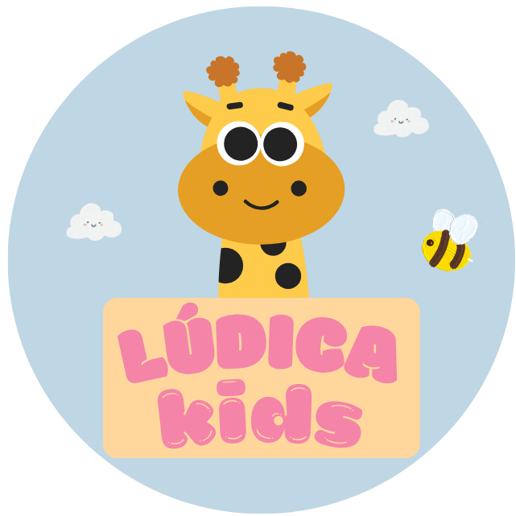
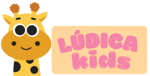

# LÚDICA KIDS

## Sobre o Lúdica Kids
> **"Brincar para acalmar, aprender para crescer."**

O **Lúdica Kids** é uma plataforma digital voltada ao desenvolvimento infantil por meio de atividades interativas, educativas e lúdicas. Seu objetivo é contribuir para o combate à ansiedade infantil, estimulando habilidades cogitivas e emocionais das crianças. 
O site possui caráter exclusivamente informativo, oferecendo orientações e esclarecimentos sobre as atividades e jogos, que estarão disponíveis no aplicativo da plataforma.

Link protótipo: https://www.figma.com/proto/joOBApkZ80w0AR0g5eoz8m/L%C3%9ADICA--prot%C3%B3tipo-oficial?node-id=457-414&p=f&t=TFS4s1hcfYUwNGrU-1&scaling=scale-down&content-scaling=fixed&page-id=1%3A3&starting-point-node-id=457%3A414&show-proto-sidebar=1

---

## Funcionalidades

### 👨‍👩‍👧 Para Responsável:
* Cadastro e gerenciamento do perfil da criança;
* Acesso aos conteúdos educativos presentes nos jogos;
* Gerenciamento de múltiplos perfis caso haja mais de uma criança;
* Realização de compra de jogo é uma ação exclusiva do responsável.

### 🧒 Para Criança:
* Acesso a jogos interativos e educativos;
* Atividades que auxiliam no controle da ansiedade;
* Reconhecimento e compreensão das emoções;
* Exercícios de respiração e relaxamento;
* Estímulo dos sentidos e da atenção;
* Personalização do perfil e identidade do usuário;
* Interface simples, lúdica e de fácil uso;
---

## Objetivo Geral:
Desenvolver uma plataforma digital com jogos para crianças de 4 a 12 anos que promova o bem-estar emocional e auxilie no enfrentamento da ansiedade em um ambiente seguro e acessível.

---

## Objetivos Específicos:
Desenvolver jogos interativos baseados em técnicas psicológicas com o objetivo de auxiliar no controle da ansiedade infantil, aplicando estratégias como a técnica dos cinco sentidos e exercícios de respiração para promover a regulação emocional. Alé disso, busca-se estimular a inteligência emocional por meio da identificação de sentimentos, ao mesmo tempo em que se garante um ambiente digital seguro, acessível e adequado ao público infantil. Por fim, pretende-se validar as abordagens com o apoio do profissional Richard, assegurando embasamento científico e qualidade terapêutica.

---

## Tecnologias Utilizadas:
- HTML  
- CSS  
- JavaScript  

---

## Autores
Projeto desenvolvido por alunos da FATEC:
- GIOVANNA MONTORO BARBOSA
- LARA ANTUNES SOARES BRITO
- MARIA APARECIDA BEZERRA DE NORONHA

---
# Portfólio

- ## **Página de Cadastro e Login**

- ## **Cadastro**

- ## **Login**

---
- ## **Início:**

--- 
- ## **Menu**

--- 
 
- ## **Quem Somos?**

---
- ## **5 Sentidos Mágicos**

--- 
- ## **Respirando com Dragão**

--- 
- ## **Reconhecendo as Emoções**

---

